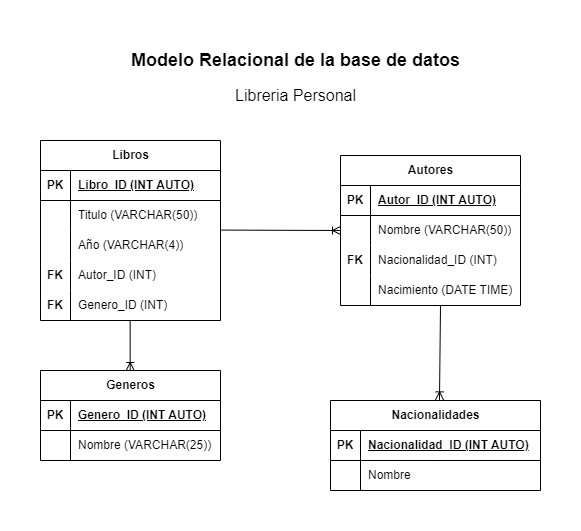

# Libreria Personal

## Lista de entidades

### Libros (ED)

- Libro_ID (Pk)
- Titulo
- Año
- Autor_ID (FK)
- Genero_ID(Fk)

### Autores  (ED)

- Autor_ID(Pk)
- Nombre
- Nacionalidad_ID(Fk)
- Nacimiento

### Nacionalidades (EC)

- nacionalidad_ID (Pk)
- nombre_nacionalidad

### Generos (EC)

- genero_ID(Pk)
- nombre_genero

### relaciones

 - **Un libro** puede tener varios **Autores** (1 a Muchos)
 - **Un libro** puede tener muchos **Generos** (1 a Muchos)
 - **Un autor** tiene una **Nacionalidad**(1 a 1)

 ### Modelo Relacional BD

### Reglas de negocio (Operaciones CRUD - _Create_, _Read_, _Update_, _Delete_)

### Libros

 1. Crear un registro de un libro.
 1. Leer los datos registrados de un libro.
 1. Leer un registro especifico de un libro.
 1. Actualizar el registro de un libro.
 1. Eliminar el registro de un libro.

### Autores

 1. Crear un registro de un autor.
 1. Leer los datos registrados de un autor.
 1. Leer un registro especifico de un autor.
 1. Actualizar el registro de un autor.
 1. Eliminar el registro de un autor.

### Nacionalidades

 1. Crear un registro de una nacionalidad.
 1. Leer los datos registrados de una nacionalidad.
 1. Leer un registro especifico de una nacionalidad.
 1. Actualizar el registro de una nacionaldiad.
 1. Eliminar el registro de una nacionalidad.

### Generos

1. Crear un registro de un genero.
 1. Leer los datos registrados de un genero.
 1. Leer un registro especifico de un genero.
 1. Actualizar el registro de un genero.
 1. Eliminar el registro de un genero.