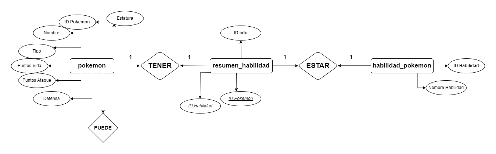
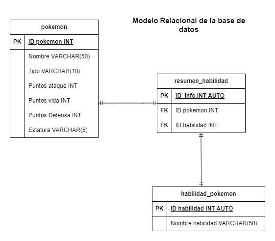

# Pokemones

## Listado Entidades(Objetos)

### pokemon (ED / Entidad de Datos)

- ID pokemon (Pk)
- Nombre 
- Tipo
- puntos de vida
- puntos de ataque
- puntos Defensa
- Estatura  

### habilidad_pokemon (EC / Entidad Catalogo)

- ID habilidad (Pk)
- nombre habilidad

### resumen_pokemon (EP / Entidad Pivote)

- ID Info(Pk)
- ID pokemon (Fk)
- ID Habilidad (Fk)

### relaciones 

1. **Un Pokemon** puede tener **resumen**.
1. **Una habilidad** puede estar en un **resumen**.

## Diagramas de la base de datos 

### Modelo entidad - relacion 

### Modelo relacional de la base de datos

## Reglas de negocio(Operaciones CRUD)

### pokemon 

1. Crear el registro de un pokemon.
1. Leer los datos del registro de un pokemon.
1. Actualizar los datos del registro de uno(s) pokemon(es).
1. Eliminar los datos del registro de uno o mas pokemones. 

## habilidad_pokemon

1. Crear un registro con una o mas habilidades de un pokemon.
1. Leer el registro de habilidades.
1. Actualizar los datos del registro de habilidades.
1. Eliminar los datos del registro de habilidades.

## resumen_pokemon

1. Crear un resumen de uno o mas pokemones.
1. Leer el los datos del resumen.
1. Actualizar los datos del resumen.
1. Eliminar uno o mas resumenes. 

